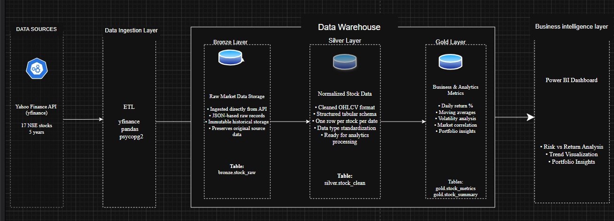

# Stockflow - Stock Market Data Warehouse & Analytics Platform

## Overview

This project builds an end-to-end financial analytics platform using Python, PostgreSQL, SQL analytics, and Power BI.

The pipeline ingests 5 years of NSE stock market data from Yahoo Finance, processes it through Bronze/Silver/Gold Medallion Architecture, and generates portfolio-level insights such as returns, volatility, moving averages, and market correlation.

## Architecture Diagram

## Tech Stack

| Category | Technology |
|----------|-------------|
| Language | Python |
| Database | PostgreSQL |
| Data Processing | Pandas |
| SQL Analytics | PostgreSQL SQL |
| Visualization | Power BI |
| API Source | Yahoo Finance (yfinance) |

## Pipeline Workflow

Yahoo Finance API
→ Python ELT Pipeline
→ Bronze Layer
→ Silver Layer
→ Gold Analytics Layer
→ SQL Analytics
→ Power BI Dashboard

## Medallion Architecture

### Bronze Layer
- Stores raw JSON market data from Yahoo Finance API
- Preserves immutable source data

### Silver Layer
- Cleans and normalizes OHLCV stock data
- Creates structured analytical schema

### Gold Layer
- Generates business and analytical metrics
- Computes daily returns, moving averages, volatility, and market correlation

## Key Features

- End-to-end ELT financial data pipeline
- Bronze/Silver/Gold warehouse architecture
- PostgreSQL-based analytical warehouse
- SQL window functions and portfolio analytics
- Risk vs return analysis
- Moving average trend analysis
- Power BI interactive dashboard

## Power BI Dashboard

### Risk vs Return Analysis

## Future Improvements

- Apache Airflow orchestration
- dbt transformation models
- Kafka streaming ingestion
- Docker containerization
- Cloud deployment (AWS/GCP)
